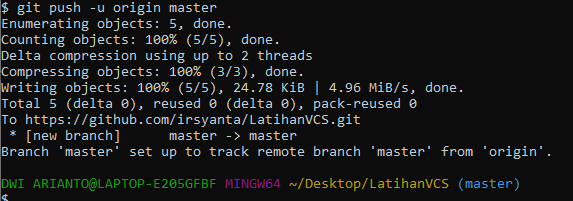

##TUTORIAL VCS

1. Login/buat akun github, lalu buat repository baru

2. Login Git di cmd, dengan perintah:
`$ git config --global user.name "UsernameAnda"`
`$ git config --global user.email "EmailAnda"`

3. Buat folder **"Latihan VCS"**

4. Klik **"Git Bash Here"** pada folder **"LatihanVCS"**

5. Ubah folder menjadi repository dengan mengetik `$ git init`

6. Tambahkan file ke repository dengan membuat **README.md** lalu ketik `$ git add README.md`

7.Buat commit dengan mengetik `$ git commit -m "Commit Pertama"`

8. Remote repository Github dengan cara mengetik `$ git remote add origin git@github.com:UserNameGit/NamaRepository.git`

9. Push ke Github dengan mengetik `$ git push -u origin master`

10. Jika terjadi error seperti gambar dibawah, kita bisa mengakalinya dengan command `$ git remote set-url "linkgithubkalian.git"

11. Jika berhasil maka akan muncul tulisan seperti berikut: 

